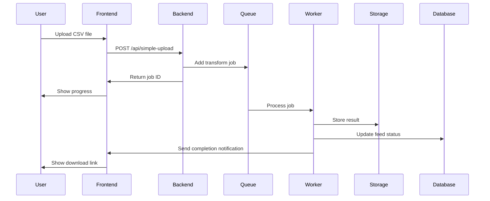
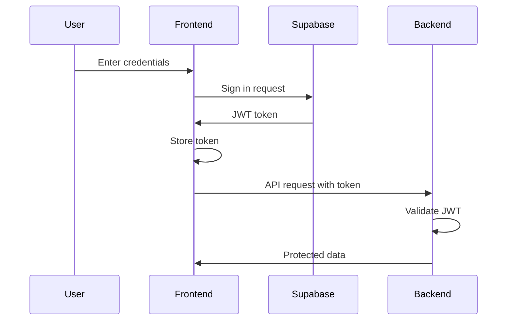
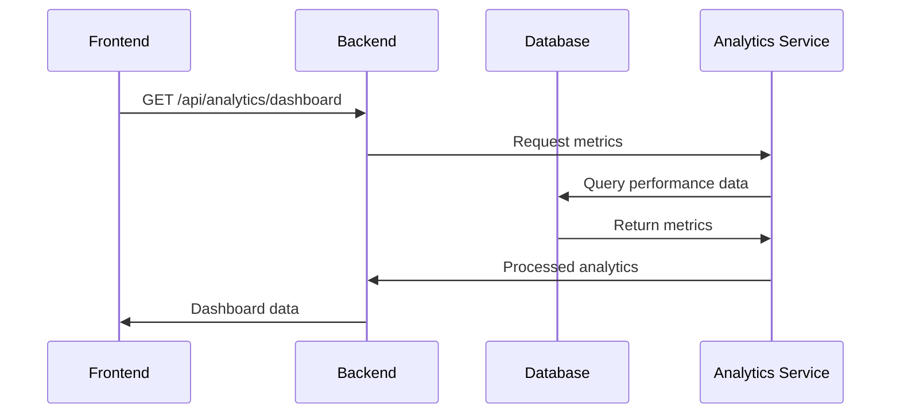

# Jadoo Architecture Documentation

## Overview

Jadoo is a modern, scalable platform for transforming product data feeds across different marketplace formats. This document outlines the system architecture, data flow, and key components.

## System Architecture

### High-Level Architecture

```
┌─────────────────────────────────────────────────────────────────┐
│                        Client Layer                             │
│  ┌─────────────┐  ┌─────────────┐  ┌─────────────┐            │
│  │   React     │  │   Vite      │  │  Tailwind   │            │
│  │  Frontend   │  │   Build     │  │     CSS     │            │
│  └─────────────┘  └─────────────┘  └─────────────┘            │
└─────────────────────────────────────────────────────────────────┘
                                │
                                ▼
┌─────────────────────────────────────────────────────────────────┐
│                      API Gateway Layer                          │
│  ┌─────────────┐  ┌─────────────┐  ┌─────────────┐            │
│  │  Express    │  │   CORS      │  │   JWT       │            │
│  │   Server    │  │   Config    │  │  Validation │            │
│  └─────────────┘  └─────────────┘  └─────────────┘            │
└─────────────────────────────────────────────────────────────────┘
                                │
                                ▼
┌─────────────────────────────────────────────────────────────────┐
│                     Business Logic Layer                        │
│  ┌─────────────┐  ┌─────────────┐  ┌─────────────┐            │
│  │ Transformer │  │   Queue     │  │ Analytics   │            │
│  │   Engine    │  │  Manager    │  │  Service    │            │
│  └─────────────┘  └─────────────┘  └─────────────┘            │
└─────────────────────────────────────────────────────────────────┘
                                │
                                ▼
┌─────────────────────────────────────────────────────────────────┐
│                      Data Layer                                 │
│  ┌─────────────┐  ┌─────────────┐  ┌─────────────┐            │
│  │  Supabase   │  │    Redis    │  │   Storage   │            │
│  │  Database   │  │    Queue    │  │   Service   │            │
│  └─────────────┘  └─────────────┘  └─────────────┘            │
└─────────────────────────────────────────────────────────────────┘
```

## Component Details

### 1. Frontend (React + TypeScript)

**Location**: `client/src/`

**Key Components**:
- **AuthContext**: Manages Supabase authentication state
- **FileUpload**: Handles drag-and-drop file uploads
- **FeedHistory**: Displays transformation history
- **AnalyticsDashboard**: Shows performance metrics
- **TransformView**: Main transformation interface

**State Management**:
- React Context for global state (auth, theme)
- React Query for server state management
- Local state for component-specific data

**Key Features**:
- Real-time progress tracking
- Responsive design with Tailwind CSS
- Type-safe development with TypeScript
- Modern UI components with Shadcn/ui

### 2. Backend API (Node.js + Express)

**Location**: `server/`

**Key Modules**:
- **Routes**: API endpoint definitions
- **Transformer**: AI-powered data transformation
- **Queue**: Background job processing
- **Storage**: Data persistence layer
- **Analytics**: Performance tracking

**API Structure**:
```
/api
├── auth/           # Authentication endpoints
├── feeds/          # Feed management
├── jobs/           # Job status and progress
├── analytics/      # Performance metrics
├── platforms/      # Marketplace templates
└── simple-upload/  # File upload endpoint
```

### 3. Authentication System

**Technology**: Supabase Auth

**Flow**:
1. User registers/signs in via frontend
2. Supabase issues JWT token
3. Frontend stores token in memory
4. Backend validates token on protected routes
5. User session persists until logout

**Security Features**:
- JWT-based authentication
- Row-level security (RLS) in database
- Automatic token refresh
- Secure password hashing

### 4. Data Transformation Engine

**Location**: `server/utils/transformer.ts`

**Process Flow**:
1. **File Upload**: CSV/Excel file uploaded via multipart form
2. **Parsing**: File parsed into structured data
3. **Field Mapping**: Input fields mapped to target schema
4. **AI Enrichment**: OpenAI GPT models enhance data
5. **Validation**: Data validated against marketplace requirements
6. **Output Generation**: Transformed data exported to XLSX

**AI Integration**:
- **Model**: GPT-4o for premium tier, GPT-4o-mini for basic
- **Concurrency**: 5 parallel LLM calls
- **Prompt Engineering**: Tier-specific optimization prompts
- **Error Handling**: Automatic retry and fallback mechanisms

### 5. Queue System

**Technology**: Redis + BullMQ

**Job Types**:
- `feed-transform`: Main transformation job
- `analytics-update`: Performance metrics update
- `cleanup`: Temporary file cleanup

**Job Lifecycle**:
1. **Queued**: Job added to Redis queue
2. **Processing**: Worker picks up job
3. **Progress**: Real-time updates via WebSocket
4. **Completed**: Results stored in database
5. **Failed**: Error logged and user notified

### 6. Database Schema

**Technology**: Supabase (PostgreSQL)

**Key Tables**:
```sql
-- User management
users (id, email, created_at, updated_at)

-- Feed management
feeds (id, user_id, filename, platform, status, output_path, summary_json)

-- Job tracking
jobs (id, feed_id, status, progress, created_at, completed_at)

-- Analytics
analytics (id, feed_id, metrics, created_at)
```

**Storage Buckets**:
- `feeds`: Transformed XLSX files
- `templates`: Marketplace template files
- `uploads`: Temporary upload files

## Data Flow

### 1. File Upload Flow



### 2. Authentication Flow



### 3. Analytics Flow



## Performance Considerations

### 1. Scalability

**Horizontal Scaling**:
- Stateless API design
- Redis-based session storage
- Load balancer ready
- Containerized deployment

**Vertical Scaling**:
- Connection pooling
- Query optimization
- Caching strategies
- Resource monitoring

### 2. Caching Strategy

**Frontend Caching**:
- React Query for API responses
- Local storage for user preferences
- Service worker for offline support

**Backend Caching**:
- Redis for session data
- Memory caching for templates
- CDN for static assets

### 3. Error Handling

**Frontend**:
- Graceful error boundaries
- User-friendly error messages
- Automatic retry mechanisms
- Offline detection

**Backend**:
- Comprehensive logging
- Error tracking and monitoring
- Circuit breaker patterns
- Fallback mechanisms

## Security Architecture

### 1. Authentication & Authorization

- JWT-based stateless authentication
- Row-level security in database
- Role-based access control
- Secure password policies

### 2. Data Protection

- Encryption at rest and in transit
- Secure file upload validation
- Input sanitization
- SQL injection prevention

### 3. Infrastructure Security

- HTTPS enforcement
- CORS configuration
- Rate limiting
- DDoS protection

## Monitoring & Observability

### 1. Application Monitoring

- Request/response logging
- Error tracking
- Performance metrics
- User analytics

### 2. Infrastructure Monitoring

- Server health checks
- Database performance
- Queue monitoring
- Storage usage

### 3. Business Metrics

- Transformation success rates
- User engagement
- Feature usage
- Revenue tracking

## Deployment Architecture

### 1. Development Environment

- Local development with hot reload
- Docker containers for services
- Environment-specific configurations
- Automated testing

### 2. Production Environment

- Lovable platform hosting
- Cloudflare CDN
- Supabase managed database
- Redis Cloud for queues

### 3. CI/CD Pipeline

- GitHub Actions for automation
- Automated testing
- Environment deployments
- Rollback capabilities

## Future Considerations

### 1. Scalability Improvements

- Microservices architecture
- Event-driven design
- Advanced caching strategies
- Global distribution

### 2. Feature Enhancements

- Real-time collaboration
- Advanced analytics
- Machine learning integration
- API marketplace

### 3. Technology Evolution

- Edge computing
- Serverless functions
- GraphQL adoption
- Real-time databases

---

This architecture provides a solid foundation for Jadoo's current needs while maintaining flexibility for future growth and evolution. 